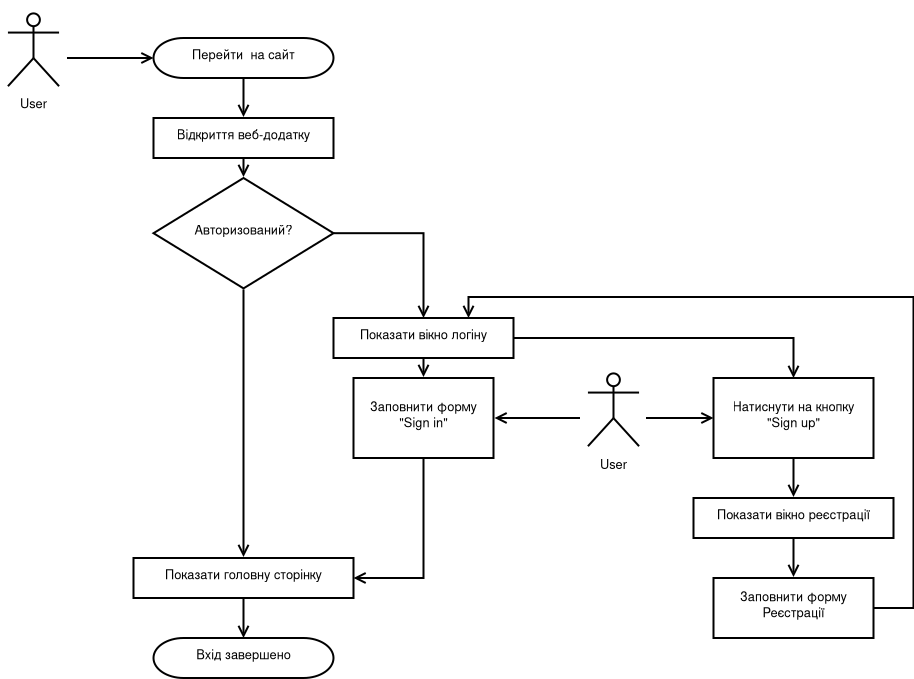
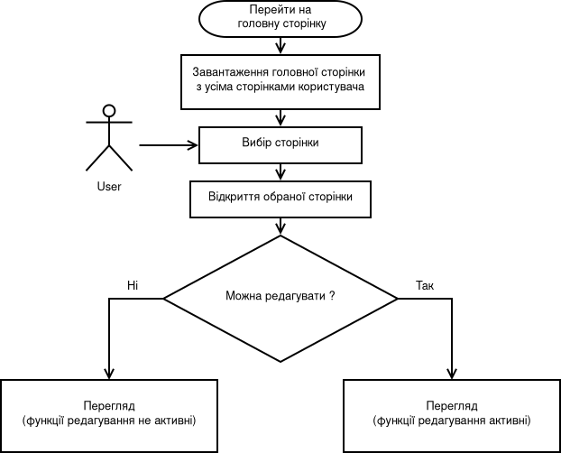
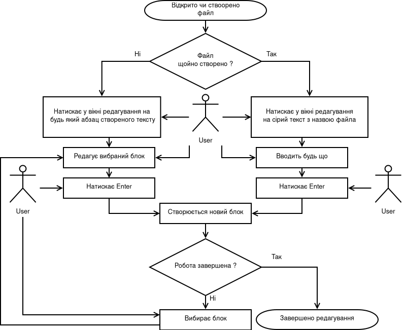

# Опис проекту

**Тип:** self-hosted веб-сервіс.

**Призначення:** зберігання "знань" - інструкцій до вирішення проблем з якими вже стикалися, специфікацій/документацій до проектів, конспектів, коротких довідників та взагалі будь-якої інформації.

# Актуальність проекту

Сьогодні люди оперують великими об'ємами інформації. Це потребує зручних засобів її організації та збереження.

Plandarm спрямований бути потрібним місцем для групування і легкого доступу до інформації.

Необхідність упорядкування інформації під час навчання, самоосвіти та роботи підштовхнула нас до пошуку готових сервісів для створення так званої **бази знань** (knowledge base). 

Нами було проаналізовано ринок готових рішень і ми дослідили їх переваги та недоліки. 

**Головні проблеми** комерційних рішень:

- обмежений фукціонал та підписочна система оплати
- шанс змін в тарифах та функціях інтерфейсу, які могла диктувати компанія-власник сервісу
- відсутність контролю над власними даними (можливість збору інформації компанією-власником сервісу)

**Переваги** комерційних рішень:

- швидке розгортання
- зручний дизайн та форматування тексту

**Недоліки** Open-source рішень:

- відсутність системи авторизації
- проблеми з форматуванням і відображенням текстів та зображень
- хаотичне подання великих об'ємів контенту ("все в розгорнутому вигляді")

**Переваги** Open-source рішень:

- self-hosted рішення, що дозволить самому контролювати свої дані
- можливість самому контролювати оновлення інтерфейсу та функціоналу

Таким чином, ми дійшли висновку, що на ринку немає збалансованого рішення: self-hosted open-source сервісу із адекватним поданням і функціоналом.

# Функціонал проекту

## Структура

Workspace → Page → Sub-page → Sub-sub-page → ... 

- **Workspace** - окремий "робочий простір" для користувача чи групи користувачів. Містить створені користувачами сторінки.
- **Page** (сторінка) -  набір блоків (Blocks). Якщо редагування дозволено, контент сторінки можна змінити за допомогою інтерфейсу сторінки (Редактор Сторінки).
    - **Block** (блок)- структурна одиниця контенту.
- **Sub-Page** (підсторінка) - сторінка, вкладена в page. Sub-page може мати свої підсторінки.

### Можливості редактора

1. Створення блоків
2. Базове форматування тексту в межах блоку (boldak, vitalic, belowline тощо)

### Блоки (Blocks)

Типи блоків:

- багаторівневий заголовок*
- абзац*
- зображення
- блок коду*
- список (нумерований і ненумерований)*
- спойлер*
- роздільник

Початковий блок кожної сторінки є абзацом. Типи блоків, позначені `*`, є взаємозамінними.

Також дані блоки підтримують форматування, вбудовування посилань.

## Пошук та організація

- повнотекстовий пошук
- групування сторінок за допомогою теґів
- дерево сторінок у сайдбарі
- секція для часто використовуваних сторінок
- секція для закріплених сторінок#

# Workflow Diagrams

---

## Діаграма входу на веб-сервіс

---

## Діаграма перегляду сторінки

---

## Діаграма редагування сторінки

---

# Стек технологій

## Back-end

### Python

Дана мова програмування має багатий інструментарій, який складається із зовнішніх бібліотек та фреймворків, необхідних для веб-розробки. 

Важливим фактором на користь **Python** також є простота синтаксису. Але, безумовно, основним критерієм вибору був досвід використання даної мови у минулому. 

### Front-end

***HTML + JS / Vue.js***

**React та Angular** — потужні фреймворки. Вони використовуються для спрощення розробки web-додатків зі ***складною*** логікою користувацького інтерфейсу. 

Проте основною ідеологією нашого проекту є ***мінімалізм, зручність та простота*** інтерфейсу. Тому ми вважаємо використання ***надпотужних*** front-end фреймворків (на кшталт Angular, ReactJS тощо) необов'язковим, ба більше — надлишковим. 

Для розробки клієнтської частини проєкту було обрано HTML і VanillaJS ("чистий" JavaScript). Цього має вистачити для розробки базового інтерфейсу прототипу.

Якщо ж можливостей HTML+JS буде недостатньо для бажаної реалізації інтерфейсу, ми плануємо використовувати **Vue.js**. 

**Vue.js** є порівняно новим і простим фреймворком. Його можна опанувати в достатньо короткі терміни. До того ж **Vue.js** легше вбудувати до вже існуючого проєкту (порівняно з Angular та ReactJS).  Це дозволить швидко мігрувати на цю технологію при потребі.
